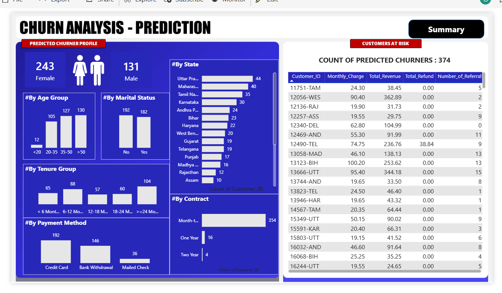
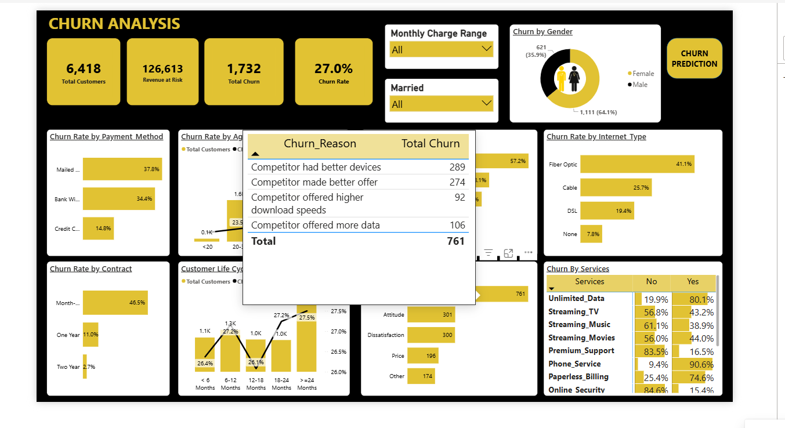

# Customer Churn Analysis Dashboard (Power BI + SQL + Python)

## 📌 Business Problem
Losing customers (churn) directly hurts recurring revenue. This project identifies **who is churning, why, and who is likely to churn next**, so the business can intervene before losing more revenue.


## 🏗️ Project Architecture

```text
                 Telecom Customer Dataset (CSV)
                            │
                            ▼
                   SQL Server (Staging)
                            │
             Data Cleaning & Transformation
                            │
                            ▼
                  Production Tables (prod_*)
                            │
              SQL Views (vw_ChurnData, vw_JoinData)
                   │                     │
                   │                     │
                   ▼                     ▼
        Power BI Dashboard      Python (Random Forest)
                   ▲                     │
                   │                     ▼
                   └──── Predictions.csv ─────┘
                            │
                            ▼
                Interactive Churn Dashboard
```

## 📁 Repo Structure
```
├── Churn_Analysis.pbix              # Power BI dashboard
├── README.md
├── churn_etl.sql                    # Staging → cleaning → production tables → views
├── churn_prediction_model.ipynb     # Random Forest churn prediction
└── 
```

## 📊 Dataset Source
Telecom customer dataset (IBM-style Telco Churn schema) — one row per customer with demographics, account info, contract/billing details, subscribed services, and churn outcome. Loaded via CSV into SQL Server as the starting point of the pipeline.
- **6,418 customers** (`prod_Churn`)
- **77,016 service records** (`prod_Services`, unpivoted from wide service columns)
- **374 active customers** scored by the model as likely future churners (`Predictions`)

## 📖 Data Dictionary

The dataset contains customer demographic, account, service, and churn-related information used for churn analysis and prediction.

| Column | Data Type | Description |
|---------|-----------|-------------|
| Customer_ID | Integer | Unique identifier assigned to each customer. |
| Gender | Text | Customer's gender (Male/Female). |
| Age | Integer | Customer's age in years. |
| Married | Text | Indicates whether the customer is married (Yes/No). |
| State | Text | State where the customer resides. |
| Number_of_Referrals | Integer | Number of customers referred by this customer. |
| Tenure_in_Months | Integer | Number of months the customer has been with the company. |
| Value_Deal | Text | Promotional offer or discount applied to the customer's account. |
| Phone_Service | Text | Indicates whether the customer subscribes to phone service. |
| Multiple_Lines | Text | Indicates whether the customer has multiple phone lines. |
| Internet_Service | Text | Indicates whether the customer subscribes to internet service. |
| Internet_Type | Text | Internet technology used (Fiber Optic, DSL, Cable, etc.). |
| Online_Security | Text | Whether online security service is enabled. |
| Online_Backup | Text | Whether online backup service is enabled. |
| Device_Protection_Plan | Text | Whether device protection is subscribed. |
| Premium_Support | Text | Whether premium technical support is active. |
| Streaming_TV | Text | Whether streaming TV service is subscribed. |
| Streaming_Movies | Text | Whether streaming movie service is subscribed. |
| Streaming_Music | Text | Whether streaming music service is subscribed. |
| Unlimited_Data | Text | Indicates whether unlimited data is included. |
| Contract | Text | Customer contract type (Month-to-Month, One Year, Two Year). |
| Paperless_Billing | Text | Indicates whether paperless billing is enabled. |
| Payment_Method | Text | Customer's payment method. |
| Monthly_Charge | Decimal | Monthly subscription charge. |
| Total_Charges | Decimal | Total charges incurred by the customer. |
| Total_Refunds | Decimal | Total refunds issued to the customer. |
| Total_Extra_Data_Charges | Decimal | Charges for additional data usage. |
| Total_Long_Distance_Charges | Decimal | Charges for long-distance calls. |
| Total_Revenue | Decimal | Total revenue generated from the customer. |
| Customer_Status | Text | Current customer status (Stayed, Churned, Joined). |
| Churn_Category | Text | High-level category describing why the customer churned. |
| Churn_Reason | Text | Specific reason the customer left the service. |

## 🖼️ Screenshots

**Churn Prediction Page**


**Summary Page**


## 🗂️ Dashboard Pages
1. **Summary** — churn overview: KPIs (Total Customers, Churn Rate, Revenue at Risk), broken down by gender, age group, contract type, payment method, tenure, state, internet type, and churn reason.
2. **Churn Prediction** — forward-looking view of predicted churners, segmented by age, marital status, tenure, payment method, contract, and state.
3. **Tool Tip** — hover tooltip page (Churn Reason vs Total Churn).

## 🧮 Key DAX Measures
See Core logic:

| Measure | Logic | What it means |
|---|---|---|
| `Total Customers` | `COUNT(Customer_ID)` | Total customer base |
| `Total Churn` | `SUM(Churn Status)` | Count of churned customers |
| `Churn Rate` | `Total Churn / Total Customers` | % of customers lost |
| `Monthly Revenue at Risk` | `SUM(Monthly_Charge)` filtered to Churned | Recurring revenue lost to churn |
| `New Joiners` | Customers with status = "Joined" | Growth offsetting churn |

## 🗄️ SQL (ETL)
Full script: [`sql/churn_etl.sql`](churn_etl.sql). Summary:
1. Load raw CSV into a `stg_Churn` staging table
2. Explore data quality — distinct-value checks per category, null counts across all columns
3. Clean nulls (defaults like `'None'`/`'No'`) and load into `prod_Churn`
4. Create two views: `vw_ChurnData` (Churned + Stayed → model training) and `vw_JoinData` (active Joiners → model scoring)

## 🐍 Python (Prediction Model)
Full notebook: [`python/churn_prediction_model.ipynb`](churn_prediction_model.ipynb). Summary:
- Pulled `vw_ChurnData`, label-encoded categorical fields, target = `Customer_Status` (Stayed=0, Churned=1)
- Trained a `RandomForestClassifier` (100 trees), 80/20 train-test split
- Applied the trained model to `vw_JoinData` to flag likely churners → `Predictions.csv` → re-imported into Power BI

**Why Random Forest:** an ensemble of decision trees, each trained on a random subset of data/features, voting on the final prediction. This reduces overfitting vs. a single decision tree and is a solid baseline for tabular business data like this.

## 📈 Model Evaluation & Limitations
Actual results on this dataset (20% held-out test set, 1,202 customers):

| | Precision | Recall | F1 |
|---|---|---|---|
| Stayed | 0.86 | 0.93 | 0.90 |
| Churned | 0.79 | 0.63 | 0.70 |

**Overall accuracy: 84%**

**Top predictive features:** Total_Revenue, Contract, Total_Charges, Total_Long_Distance_Charges, Monthly_Charge.

**Limitations:**
- **Recall on Churned = 0.63** → the model misses ~37% of actual churners (129 of 347 in the test set). For a retention use case, missed churners are the costly error — worth tuning the classification threshold or using class weighting to catch more of them, even at the cost of some false positives.
- **No probability/confidence score** carried into the `Predictions` table — it's a hard 0/1 flag, so the dashboard can't currently show "high vs. low risk," only "flagged vs. not."
- **Class imbalance** (73% Stayed vs 27% Churned) biases the model toward predicting "Stayed" — reflected in the recall gap above.
- Model trained on a single historical snapshot; no retraining schedule or drift monitoring in place yet.

## 💡 Key Findings
- **27.0% overall churn rate** (1,732 of 6,418 customers)
- **Month-to-month contracts churn at 46.5%**, vs. 11.0% (1-year) and 2.7% (2-year) — contract length is the single biggest churn driver
- **$126,613.10/month** in recurring revenue at risk from churned customers
- Newer customers (low tenure) churn at a higher rate — biggest drop-off is early in the customer lifecycle
- 374 active customers currently flagged as likely to churn next

## ✅ Business Recommendations
1. **Incentivize longer contracts** — a discount or perk for switching from month-to-month to annual could meaningfully cut churn, given the 46.5% vs 2.7% gap.
2. **Prioritize retention outreach on the 374 flagged customers**, starting with highest Monthly_Charge / Total_Revenue accounts — the model shows these features are the strongest churn signals.
3. **Target the first few months of tenure** with onboarding/engagement touchpoints, since early tenure is the highest-risk window.
4. **Investigate churn reasons** (Tool Tip page) alongside these drivers to design offers that address root causes, not just symptoms.

## ✏️ What I Personally Changed
Starting from the original build guide, I:
- Extracted the dashboard's actual data model and DAX directly from the `.pbix` (rather than relying on the write-up) to confirm the measures matched what's really deployed
- Ran the ETL → model pipeline against the real embedded dataset to replace placeholder metrics with **actual computed numbers** (churn rate, revenue at risk, contract-level churn rates, confusion matrix, precision/recall)
- Added the **Model Evaluation & Limitations** section — the original guide didn't report accuracy/recall or call out the class-imbalance / recall trade-off
- Removed the unused blank "Page 1" from the report
- Organized the project into a proper repo structure (`sql/`, `python/`, `dax/`) instead of a single write-up

## 📧 Beyond the Dashboard: Communication for Impact
Besides making great dashboards, I also help clients understand the data and make smart decisions with it. By sending clear emails, I:
- **Shared important findings:** Summarized data nicely focusing on what matters.
- **Tailored messages:** Adjusted my language to match the client's knowledge level.
- **Suggested actions:** Gave specific advice on what to do next.

**Sample Email:**

> **Hello Janet,**
>
> I am glad to hear from you and I appreciate the opportunity to work on this project. I have analyzed the data and created a dashboard using Power BI that shows the customer churn situation in a clear and concise way.
>
> Here are some of the insights and suggestions that I have derived from the data. Please let me know your feedback on them.
>
> **Insights:**
> - The customer churn rate was 27%, which means that out of 6,418 customers, 1,732 left the company.
> - Contract length is the strongest churn driver: month-to-month customers churn at 46.5%, versus 11.0% (1-year) and 2.7% (2-year) contracts.
> - Newer customers (lower tenure) are more likely to switch to other providers — the risk is highest in the first few months.
> - $126,613/month in recurring revenue is currently at risk from churned customers.
> - Our prediction model has flagged 374 active customers as likely to churn next, based on factors like total revenue, contract type, and monthly charges.
>
> **Suggestions:**
> - The company should consider incentivizing longer contracts — offering a discount or perk to move customers from month-to-month to annual plans, given the 46.5% vs 2.7% churn gap.
> - The company should prioritize retention outreach on the 374 flagged customers, starting with the highest-revenue accounts.
> - The company should strengthen onboarding and engagement in the first few months of the customer lifecycle, since that's where the biggest drop-off happens.
>
> Thank you for your time and attention.
>
> Best regards,
> [Your Name]

## 🛠️ Tech Stack
- SQL Server + SSMS (ETL, staging → production tables, views)
- Power BI Desktop (Power Query transforms, data model, DAX, visuals)
- Python (pandas, scikit-learn, seaborn) in Jupyter Notebook — Random Forest churn prediction model

## 🚀 How to Use
1. Open `Churn_Analysis.pbix` in Power BI Desktop.
2. Explore the **Summary** page for diagnosis, **Churn Prediction** for forward-looking action.
3. Review `sql/`, `python/` for the full pipeline behind the dashboard.


## 📚 Lessons Learned

During this project, I gained hands-on experience in building an end-to-end analytics solution rather than just creating dashboards.

### Key Takeaways

- Designed a SQL ETL pipeline to transform raw customer data into analysis-ready tables.
- Improved data quality by handling missing values and validating categorical fields.
- Built reusable SQL views to separate historical churn data from active customers.
- Learned how feature engineering and data preprocessing affect machine learning performance.
- Evaluated the Random Forest model using precision, recall, F1-score, and confusion matrix instead of relying solely on accuracy.
- Applied DAX and Power Query to create interactive KPIs and dynamic visualizations.
- Converted business questions into actionable insights and recommendations.
- Improved project documentation and GitHub organization to make the work reproducible and easier to understand.
